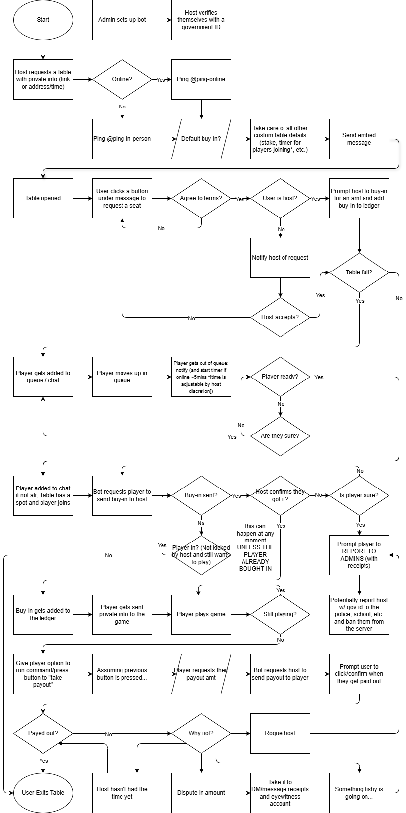

# Floor Manager Bot Design Doc and Roadmap

The main design document for the Floor Manager Discord bot.

## Table of Contents

- [Floor Manager Bot Design Doc and Roadmap](#floor-manager-bot-design-doc-and-roadmap)
  - [Table of Contents](#table-of-contents)
  - [Purpose](#purpose)
  - [Users and Diagrams](#users-and-diagrams)
    - [User Flow Diagram](#user-flow-diagram)
  - [Features and ADRs](#features-and-adrs)
    - [Main Features](#main-features)
  - [Other Technical Requirements](#other-technical-requirements)
    - [Technologies and Tools](#technologies-and-tools)

## Purpose

The Floor Manager bot was an initiative to create a Discord bot that would mitigate ping spamming, unreliable hosts, and enhance the overall experience of starting a live or online poker game on Discord. This bot aims to provided a structured and accountable way for users to create, manage, and participate in poker games while ensuring that all financial transactions are transparent and verifiable.

## Users and Diagrams

There are three main kinds of users considered in our design:

- Hosts: Users who create and manage poker tables.
- Players: Users who join and play at poker tables.
- Administrators: Users who manage the bot and its features or permissions.

### User Flow Diagram

## Features and ADRs

### Main Features

- Table Management
  - Create, edit, and close poker tables
  - Set rules, buy-in amount, capacity, and game type
  - Queue and attendance tracking
- Ledger Management
  - Track player buy-ins and payouts
  - Maintain historical financial records per game
  - Differentiate between pending and confirmed transactions
- Transaction Verification
  - Players can view pending and completed transaction history
  - Admins can audit ledgers and resolve disputes

## Other Technical Requirements

### Technologies and Tools

[Discord.js](https://discord.js.org/): For interacting with the Discord API.
[Node.js](https://nodejs.org/): JavaScript runtime for executing server-side logic.
[Firestore (Firebase)](https://firebase.google.com/docs/firestore): A scalable NoSQL cloud database to manage persistent data.

How will data be stored and managed in the bot?

- User Data
  - Their discord ID, username, and other relevant information
  - The history of their games and transactions
  - Reports / Strikes / Rating of the player/host
- Game data
  - Rules and configuration (e.g., game type, buy-in amounts, online/in-person)
  - Number of players currently in the queue or at the table
  - Public information for when the game is planning to be held
  - The private information provided by the host (link, addy, etc.)
  - Status of buy-in requests and payout requests
  - Ledger
    - All CONFIRMED transaction history
    - All PENDING transaction history
    - The amount of money each player has gotten in or out

Where will the bot be hosted?

- The bot will be hosted on [Firebase Functions](https://firebase.google.com/products/functions) to run serverless for Poker Tritons.
